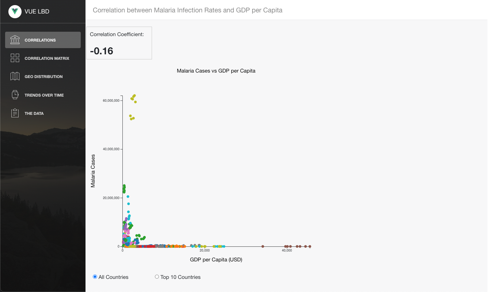

# DSCI 554 Group Project

> Team "Sankeyou" - Melissa Perkins, Shreyansh Ajaykumar Khandelwal, Kaushik Golithadka, and Eben Gunadi

[ASSIGNMENT.md](ASSIGNMENT.md) contains the Rubric

Check the [Live Demo here](https://egunadi.github.io/dsci554-project).

## :rocket: Getting started

Vue Light Bootstrap Dashboard is built on top of Bootstrap 4, Vuejs and Vue-router. To get started do the following steps:

1. Download the project
2. Make sure you have node.js (https://nodejs.org/en/) installed
3. Type `npm install` in the source folder where `package.json` is located
4. Type `npm run dev` to start the development server

The repo uses [vue-cli](https://github.com/vuejs/vue-cli) scaffolding which takes care of the development setup with webpack and all the necessary modern tools to make web development faster and easier.

## Documentation

Our Overleaf report contains the project's implementation details.

## :cloud: Build Setup

### install dependencies

`npm install`

### serve with hot reload at localhost:8000

`npm run dev`

### build for production with minification

`export NODE_OPTIONS=--openssl-legacy-provider`
`npm run build`
